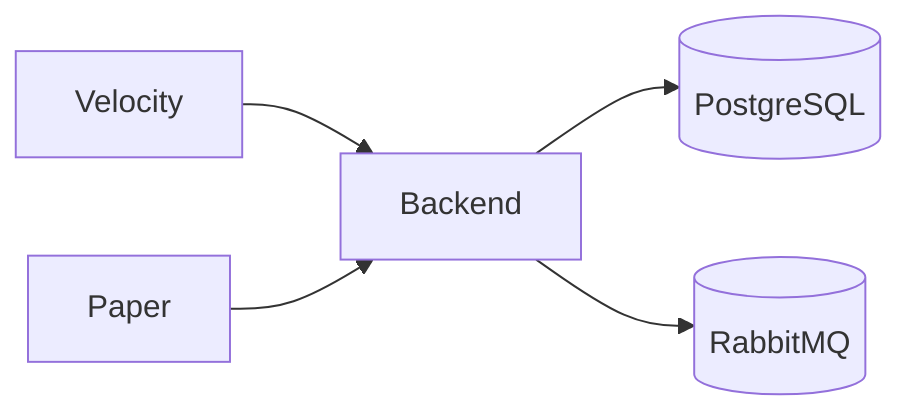

# Backend

The central Spring Boot (Kotlin) service. Full source and the always-current API live in the [`btg-backend` repository](https://github.com/Beyond-The-Gate/btg-backend).

Implements the **[Systems](../systems/index.md)**: players, dungeons, friends, moderation.

## Example diagram

