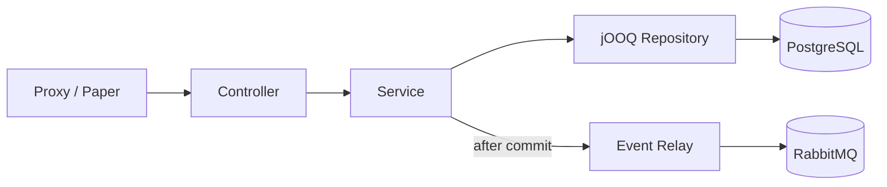
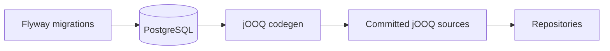

# Architecture

## Stack

| Layer | Technology | Notes |
|---|---|---|
| Language | Kotlin | JDK 25 toolchain |
| Framework | Spring Boot 4.1 | Web MVC, Security, OAuth2 Resource Server, AMQP, Actuator |
| Build | Gradle (Kotlin DSL) | Multi-module |
| Data access | jOOQ | Type-safe SQL, generated from the live schema |
| Migrations | Flyway | Forward-only, owns the schema |
| Database | PostgreSQL 18 | All timestamps `TIMESTAMPTZ` (UTC) |
| Messaging | RabbitMQ | Topic exchange `btg.events` |
| Testing | JUnit 5 + Spring MockMvc | Opt-in integration suite |
| Linting | ktlint | Generated sources excluded |
| Concurrency | Virtual threads | Enabled |

## Modules

A two-module Gradle build:

| Module | Purpose | JVM target |
|---|---|---|
| `contracts` | Pure-Kotlin DTOs, enums and event payloads. No Spring, no DB. | **21** |
| `backend` | The Spring Boot application. | **25** |

!!! info "Why the contracts module targets JVM 21"
    The contracts jar is consumed by the Minecraft plugins (Velocity/Paper), which may run on Java 21. Bytecode compiled for 21 runs on 21 **and** 25; the reverse isn't true. So contracts are pinned to 21 while the backend uses 25.

## Layered request flow



- **Controller** — thin; maps HTTP to service calls, no logic.
- **Service** — business logic + `@Transactional` boundaries; emits domain events.
- **Repository** — jOOQ queries only; returns records/projections.
- **Event Relay** — forwards domain events to RabbitMQ *after the transaction commits*.

## Package layout

```
eu/beyondthegate/backend/
├── BackendApplication.kt
├── common/        # cross-cutting: error model + handler
├── config/        # @Configuration beans (security, rabbit)
├── player/        # controller + service + repository
├── dungeon/
├── friend/        # incl. FriendEventRelay
└── moderation/
```

Rule of thumb: `config/` wires beans, `common/` holds cross-cutting concerns, everything else is a self-contained **feature slice** (controller + service + repository + its own components).

## Schema-first data access

Flyway is the **single source of truth** for the schema. jOOQ then generates type-safe Kotlin from the live database into a committed source folder.



Because the generated code is committed, normal builds need no database; codegen only runs when the schema changes.

## Messaging

A durable **topic exchange** `btg.events`. Services publish JSON events (shared contract types) with routing keys describing what happened. Events are published **after commit** via Spring's `@TransactionalEventListener(AFTER_COMMIT)` so a rollback never leaks an event.

## Error handling

Services throw **domain exceptions** (`NotFoundException`, `ConflictException`, `BadRequestException`) with no web coupling. A single `@RestControllerAdvice` maps them to HTTP statuses and a small `ApiError` body. HTTP concerns live in exactly one place.

## Configuration

All secrets come from environment variables:

| Variable | Description |
|---|---|
| `DB_PASSWORD` | PostgreSQL password |
| `RABBITMQ_USER` / `RABBITMQ_PASSWORD` | Broker credentials |
| `JWT_SECRET` | HMAC secret for player JWTs (planned) |
| `SERVICE_API_KEY` | Durable key for MC servers (planned) |

The JVM runs in UTC so timestamps are unambiguous end-to-end.

## Testing

- **Unit** (`:backend:test`) — fast, no database.
- **Integration** (`:backend:integrationTest`) — opt-in, against a dedicated `btg_test` database; truncates between tests for isolation. Tagged `integration` and excluded from the default build.

## Security

!!! warning "Work in progress"
    A temporary permit-all config is active. The planned model: `/game/**` authenticated by a durable **API key** (`ROLE_SERVICE`), `/web/**` by **player JWT** (`ROLE_PLAYER`), validated via the OAuth2 Resource Server.
