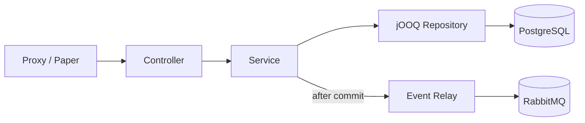
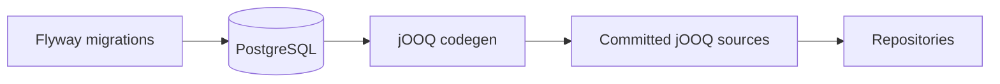

# Architecture

## :material-layers: Stack

| Layer | Technology | Notes |
|---|---|---|
| Language | Kotlin | JDK 25 toolchain |
| Framework | Spring Boot 4.1 | Web MVC, Security, OAuth2 Resource Server, AMQP, Actuator |
| Build | Gradle (Kotlin DSL) | Multi-module |
| Data access | jOOQ | Type-safe SQL, generated from the live schema |
| Migrations | Flyway | Forward-only, owns the schema |
| Database | PostgreSQL 18 | All timestamps `TIMESTAMPTZ` (UTC) |
| Messaging | RabbitMQ | Topic exchange `btg.events` |
| Testing | JUnit 5 + Spring MockMvc | Opt-in integration suite |
| Linting | ktlint | Generated sources excluded |
| Concurrency | Virtual threads | Enabled |

## :material-package-variant: Modules

A two-module Gradle build:

| Module | Purpose | JVM target |
|---|---|---|
| `contracts` | Pure-Kotlin DTOs, enums and event payloads. No Spring, no DB. | **21** |
| `backend` | The Spring Boot application. | **25** |

!!! info "Why the contracts module targets JVM 21"
    The contracts jar is consumed by the Minecraft plugins (Velocity/Paper), which may run on Java 21. Bytecode compiled for 21 runs on 21 **and** 25; the reverse isn't true. So contracts are pinned to 21 while the backend uses 25.

## :material-transit-connection-variant: Layered request flow



<div class="grid cards" markdown>

-   :material-flash: __Controller__

    Thin — maps HTTP to service calls. No logic.

-   :material-cogs: __Service__

    Business logic + `@Transactional` boundaries; emits domain events.

-   :material-database-search: __Repository__

    jOOQ queries only; returns records / projections.

-   :material-transit-connection: __Event Relay__

    Forwards domain events to RabbitMQ *after the transaction commits*.

</div>

## :material-folder-tree: Package layout

```
eu/beyondthegate/backend/
├── BackendApplication.kt
├── common/        # cross-cutting: error model + handler
├── config/        # @Configuration beans (security, rabbit)
├── player/        # controller + service + repository
├── dungeon/
├── friend/        # incl. FriendEventRelay
└── moderation/
```

<div class="grid cards" markdown>

-   :material-cog: __`config/`__

    Wires beans (security, rabbit).

-   :material-share-variant: __`common/`__

    Cross-cutting concerns (error model + handler).

-   :material-puzzle: __Feature slices__

    Everything else is self-contained: controller + service + repository + its own components.

</div>

## :material-database-arrow-down: Schema-first data access

Flyway is the **single source of truth** for the schema. jOOQ then generates type-safe Kotlin from the live database into a committed source folder.



!!! tip "No database needed for normal builds"
    Because the generated code is committed, day-to-day builds need no database — codegen only runs when the schema changes.

## :material-rabbit: Messaging

A durable **topic exchange** `btg.events`. Services publish JSON events (shared contract types) with routing keys describing what happened.

!!! note "Published after commit"
    Events fire via Spring's `@TransactionalEventListener(AFTER_COMMIT)`, so a rollback never leaks an event.

## :material-alert-circle: Error handling

Services throw **domain exceptions** (`NotFoundException`, `ConflictException`, `BadRequestException`) with no web coupling. A single `@RestControllerAdvice` maps them to HTTP statuses and a small `ApiError` body.

!!! abstract "One responsibility, one place"
    HTTP concerns live in exactly one class — services stay framework-agnostic.

## :material-cog: Configuration

All secrets come from environment variables:

| Variable | Description |
|---|---|
| `DB_PASSWORD` | PostgreSQL password |
| `RABBITMQ_USER` / `RABBITMQ_PASSWORD` | Broker credentials |
| `JWT_SECRET` | HMAC secret for player JWTs (planned) |
| `SERVICE_API_KEY` | Durable key for MC servers (planned) |

The JVM runs in UTC so timestamps are unambiguous end-to-end.

## :material-test-tube: Testing

<div class="grid cards" markdown>

-   :material-lightning-bolt: __Unit__ · `:backend:test`

    Fast, no database.

-   :material-database-check: __Integration__ · `:backend:integrationTest`

    Opt-in, against a dedicated `btg_test` database; truncates between tests for isolation. Tagged `integration` and excluded from the default build.

</div>

## :material-shield-lock: Security

!!! warning "Work in progress"
    A temporary permit-all config is active. The planned model:

    | Surface | Auth | Role |
    |---|---|---|
    | `/game/**` | durable API key | `ROLE_SERVICE` |
    | `/web/**` | player JWT | `ROLE_PLAYER` |

    JWTs validated via the OAuth2 Resource Server.
