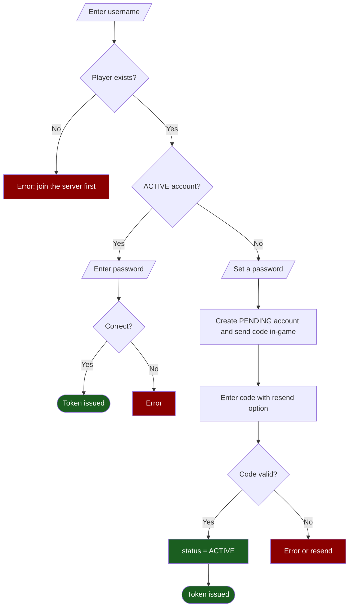
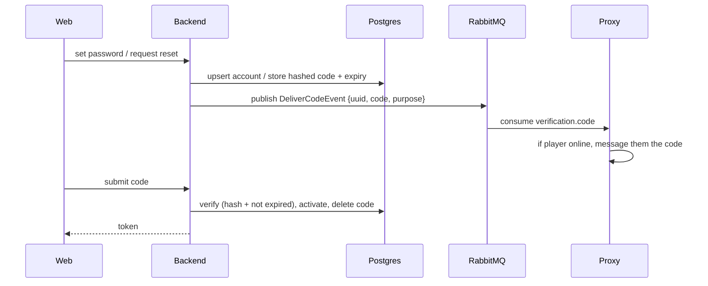

# Web Login & Verification

How a Minecraft player gains access to the website. Identity is always proven the same way — by entering a code delivered **in-game**, which only the real account holder can receive.

!!! abstract "TL;DR"
    1. Enter your Minecraft username.
    2. If you already have an account → enter your password. If not → set one, then confirm a code sent to you in-game.
    3. You receive a token. Forgot your password? Reset it via the same in-game code.

## The flow

The branch that matters: the login path requires an **ACTIVE** account, not merely a row that exists.

## Account states

A `web_account` row exists only once a password has been set, and lives in one of two states:

| State | Meaning |
|---|---|
| `PENDING` | a password is set, but it has not been confirmed by an in-game code |
| `ACTIVE` | confirmed — the account can log in |

- **Login requires `ACTIVE`.** A `PENDING` account cannot log in.
- **`identify` returns `REGISTER` for anything that isn't `ACTIVE`** (no account *or* `PENDING`), so the frontend always shows the set-password path until verification succeeds.

## Why it's secure (anti-squatting)

Setting a password on a `PENDING` (or missing) account is allowed and simply **overwrites** it — but setting one on an **ACTIVE** account is rejected (`409`). Nothing is "owned" until the in-game code promotes `PENDING → ACTIVE`, and that code is delivered **only to the real Minecraft player**.

So an attacker can *claim* a username (creating a `PENDING` row with their password), but they can never verify it. When the real owner later sets their own password, it overwrites the attacker's `PENDING` row, the code goes to the real player, and they activate. The attacker is locked out throughout.

## In-game code delivery

- Codes are **6-digit, valid for 10 minutes**, single-use, and stored **hashed** — the plaintext exists only inside the `DeliverCodeEvent` (see [Events › Verification codes](events.md#verification-codes)).
- Delivery is **best-effort**: the player must be online. If they weren't, the **resend** button issues a fresh code and invalidates the previous one.
- Activation and password-reset use separate code purposes, so they never collide.

## Password reset

For an **ACTIVE** account only: request a reset (sends a `PASSWORD_RESET` code in-game), then confirm with the code + a new password. On success the password is replaced and a token is issued.

## Tokens

On successful login, verification, or reset-confirm the backend returns an [`AuthTokenResponse`](api.md#authtokenresponse): a signed JWT (`sub` = player UUID, `name`, `role = PLAYER`) plus its `expiresAt`, `playerUuid`, and `playerName`.

!!! warning "Enforcement pending"
    Tokens are **minted** today, but validation/enforcement on `/web/**` is part of the upcoming security work. Until then the temp permit-all config is active — do not deploy publicly.

See the endpoint reference in [API › Web Authentication](api.md#web-authentication).
