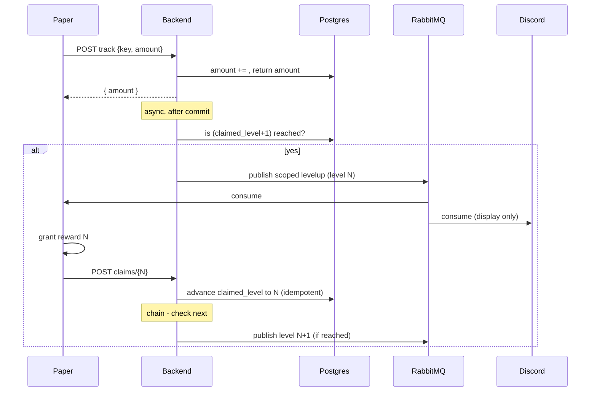

# Collection Levels

How collection rewards are detected, granted exactly once, and kept correct across rebalances.

!!! info "Two scopes, one mechanism"
    Collections exist in two scopes — **player** (`player_collection`) and **dungeon** (`dungeon_collection`), selected by the catalog entry's `scope`. Both use the identical ledger described here (each row has its own `amount` + `claimed_level`); they differ only in what they're keyed by and which event fires: `collection.player.levelup` ([`CollectionLevelUpEvent`](events.md#collectionlevelupevent)) versus `collection.dungeon.levelup` ([`DungeonCollectionLevelUpEvent`](events.md#dungeoncollectionlevelupevent)). The rest of this page is written in terms of `player_collection`; dungeon collections behave the same, keyed by dungeon.

## The two numbers

Each `player_collection` row holds two independent values:

| | meaning |
|---|---|
| `amount` | accumulated progress (only ever grows, via tracking) |
| `claimed_level` | high-water mark: the highest level whose reward has been **confirmed granted** |

A level `L` is **reached** when `amount >= required_amount(L)`, and **claimable** when it is *both* reached *and* exactly `claimed_level + 1`. The reward for `L` is granted exactly once, when `claimed_level` advances from `L-1` to `L`.

!!! warning "Level numbers are stable identities"
    Rebalancing means changing a level's `required_amount` — **never renumbering**. The claim ledger points at level *numbers*; reordering them would misattribute rewards. Append new levels and retune thresholds; don't reorder.

## The flow

The backend is the orchestrator: it emits **one** levelup at a time and only advances the ledger when Paper confirms the grant.

1. **`track` stays fast** — it only updates `amount` and returns. The levelup check runs after commit, off the response thread.
2. **One outstanding levelup per collection.** Only `claimed_level + 1` is ever emitted; the next is emitted after the current is confirmed. A track that jumps several thresholds therefore fires events **in strict order**, gated on each confirm — Paper never has to reorder.
3. **Confirm advances the ledger.** `POST .../claims/{level}` is idempotent: it advances only when `level == claimed_level + 1` *and* the threshold is reached. Duplicates, out-of-order, and not-yet-reached confirms are safe no-ops.

## Guarantees

- **No double-claim:** a level below or at `claimed_level` can never be re-emitted or re-advanced.
- **No skips:** only the immediate next level is ever claimable.
- **Exactly-once (record):** the ledger advances at most once per level. RabbitMQ is at-least-once, so Paper may receive a duplicate event — it must treat granting idempotently (it can check `claimed_level` first). The backend record is the source of truth.
- **Rebalance-safe:** `claimed_level` is independent of thresholds. Lowering a threshold makes a new level claimable (a real new reward); raising one above `amount` simply pauses progress — already-claimed rewards are never revoked or re-granted.

## Recovery

If a levelup event is lost (e.g. Paper offline), `claimed_level` simply doesn't advance — the reward stays pending and is never lost. It is re-delivered by either:

- **the next `track`** — detection is "reached & unclaimed", not edge-based, so a still-pending level re-emits; or
- **reconcile on join** — Paper calls `POST .../collections/reconcile` after a successful join, which re-emits the next pending levelup for every collection. This also delivers levels newly earned by a catalog rebalance on the player's next login.
