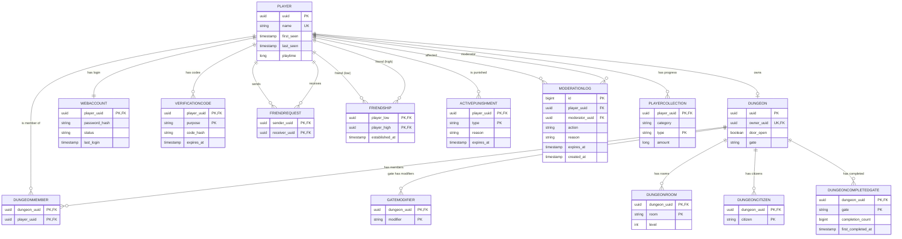

# Data Model

PostgreSQL, owned by Flyway. All timestamps are `TIMESTAMPTZ` (UTC).

## Entity relationships

## Identity

### `player`
The anchor entity; almost everything links back to it.

- `uuid` (PK) — Minecraft UUID.
- `name` (unique, **nullable**) — cached *current* Minecraft name.
- `first_seen`, `last_seen`, `playtime` (ms).

!!! note "Why `name` is nullable"
    A player's name is a cache of their current Minecraft name. If a name is reassigned to another player before the previous owner rejoins, that older record's name is temporarily **unknown** — modeled as `NULL`. Uniqueness is kept (Postgres treats multiple `NULL`s as distinct).

### `web_account` (1:1 with player)
`password_hash`, `status` (`PENDING` / `ACTIVE`), `last_login`. A row exists only once a password is set; only `ACTIVE` accounts may log in. *(Planned feature.)*

### `verification_code`
PK `(player_uuid, purpose)` — one active code per purpose. Stores a `code_hash` + `expires_at`. *(Planned feature.)*

## Dungeons

### `dungeon`
One per player, enforced by a **unique** `owner_uuid`. Holds `door_open` and the current `gate` (nullable). A surrogate `uuid` PK keeps identity stable so ownership can transfer cheaply.

### `dungeon_member`
Join table for trusted players. PK `(dungeon_uuid, player_uuid)`. The owner is implicit (never a member row).

### `gate_modifier`
Set of modifier strings for the active gate. PK `(dungeon_uuid, modifier)`.

### `dungeon_room`
PK `(dungeon_uuid, room)`, plus `level` (default 1). Every dungeon is seeded with a `"main"` room on creation.

### `dungeon_citizen`
Saved NPCs. PK `(dungeon_uuid, citizen)`. Minimal today, will expand.

### `dungeon_completed_gate`
Tracks completed gates per dungeon: `completion_count` (default 1) and `first_completed_at`. PK `(dungeon_uuid, gate)`. On re-completion the count increments while `first_completed_at` is preserved.

## Progression

### `player_collection`
Per-player counters. PK `(player_uuid, type)`, with a `category` grouping and `amount`. The catalog (which types/categories exist) lives game-side, not in the DB.

## Social

### `friend_request`
Directed request, PK `(sender_uuid, receiver_uuid)`, `CHECK sender ≠ receiver`. No timestamp by design.

### `friendship`
Undirected, stored **once** in canonical order: PK `(player_low, player_high)` with `CHECK player_low < player_high`, plus `established_at`.

!!! warning "UUID ordering"
    The canonical order uses the **lowercase hex string** comparison to match Postgres's unsigned `uuid` ordering — `java.util.UUID.compareTo` is signed and disagrees.

## Moderation

### `active_punishment`
Current ban/mute states. PK `(player_uuid, type)` with `type ∈ {BAN, MUTE}`; `expires_at` `NULL` = permanent. This is what the proxy reads on join.

### `moderation_log`
Append-only history of every action (`BAN`/`MUTE`/`UNBAN`/`UNMUTE`/`KICK`). Surrogate `id` PK; `moderator_uuid` nullable (`SET NULL`) for console/system actions.
