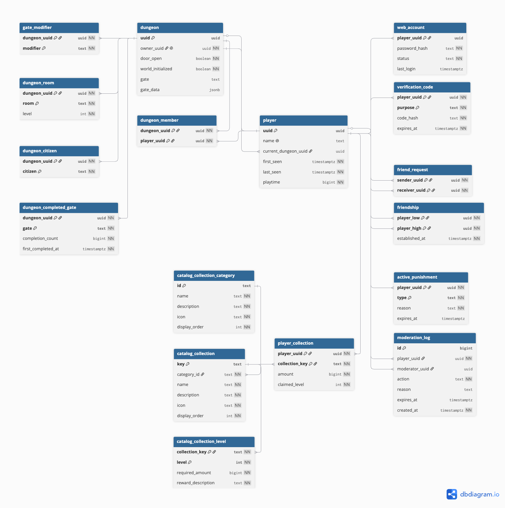

# Data Model

PostgreSQL, owned by Flyway.

## :material-sitemap: Entity relationships

[{ loading=lazy }](../../assets/data-model.png)

## :material-database: Migrations

| Version | Name | Description |
|---|---|---|
| **V1** | `init` | Baseline schema: `player`, `web_account`, `verification_code`, `dungeon` (+ `dungeon_member`, `gate_modifier`, `dungeon_room`, `dungeon_citizen`), `player_collection`, `friend_request`, `friendship`, `active_punishment`, `moderation_log`. |
| **V2** | `player_name_nullable` | Makes `player.name` nullable so a name can be temporarily unknown when reclaimed by another player. |
| **V3** | `dungeon_completed_gate` | Adds `dungeon_completed_gate` — per-dungeon gate completion tracking with count and first-completed timestamp. |
| **V4** | `collection_catalog` | Adds the static catalog (`catalog_collection_category`, `catalog_collection`, `catalog_collection_level`) and rebuilds `player_collection` to reference it (drops `category`, renames `type` → `collection_key`). |
| **V5** | `spawn_and_gate_data` | Adds `player.current_dungeon_uuid`, `dungeon.world_initialized`, and `dungeon.gate_data` (JSONB) for spawn resolution and opaque per-gate state. |
| **V6** | `collection_claimed_level` | Adds `player_collection.claimed_level` — the claim ledger high-water mark for exactly-once level rewards. |
| **V7** | `verification_code_attempts` | Adds `verification_code.attempts` — a wrong-guess counter; a code is burned once it hits the cap. |
| **V8** | `dungeon_collections` | Adds `dungeon_collection` — dungeon-scoped collection progress alongside player-scoped, selected by the catalog's `scope`. |
| **V9** | `multiserver` | Adds the multi-server coordination tables: `game_server` (registry), `dungeon_placement` (host per dungeon — PK is the single-writer lock), `player_session` (presence, one per player), `player_state` (portable inventory/xp/hunger blob with `held_by` + `version` fence). |
| **V10** | `drop_player_session_dungeon` | Drops `player_session.dungeon_uuid`; a player's live dungeon is `player.current_dungeon_uuid` while a session row exists. |
| **V11** | `consolidate_multiserver` | Folds the V9 coordination onto the entities it describes: `game_server` → `dungeon_server` (drops `kind`, `capacity`, `registered_at`); `dungeon` absorbs `dungeon_placement` (`server_uuid` + `status`); `player` absorbs `player_session` (`current_server_uuid` + `status`, and `last_seen` doubles as the presence heartbeat). Every lifecycle column is now named `status`; limbo becomes a single configured server rather than a row. |

> Migrations are forward-only and additive; each is applied automatically by Flyway on startup. File names follow `V<n>__<name>.sql` in `backend/src/main/resources/db/migration`.
