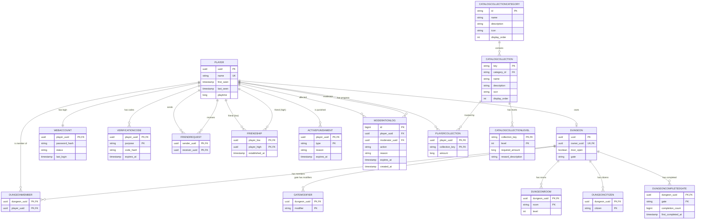

# Data Model

PostgreSQL, owned by Flyway.

## Entity relationships

```mermaid
erDiagram
    PLAYER ||--o| DUNGEON : owns
    PLAYER ||--|| WEBACCOUNT : "has login"
    PLAYER ||--o{ VERIFICATIONCODE : "has codes"
    PLAYER ||--o{ DUNGEONMEMBER : "is member of"
    PLAYER ||--o{ FRIENDREQUEST : "sends"
    PLAYER ||--o{ FRIENDREQUEST : "receives"
    PLAYER ||--o{ FRIENDSHIP : "friend (low)"
    PLAYER ||--o{ FRIENDSHIP : "friend (high)"
    PLAYER ||--o{ ACTIVEPUNISHMENT : "is punished"
    PLAYER ||--o{ MODERATIONLOG : "affected"
    PLAYER ||--o{ MODERATIONLOG : "moderator"
    PLAYER ||--o{ PLAYERCOLLECTION : "has progress"
    DUNGEON ||--o{ DUNGEONMEMBER : "has members"
    DUNGEON ||--o{ GATEMODIFIER : "gate has modifiers"
    DUNGEON ||--o{ DUNGEONROOM : "has rooms"
    DUNGEON ||--o{ DUNGEONCITIZEN : "has citizens"
    DUNGEON ||--o{ DUNGEONCOMPLETEDGATE : "has completed"
    CATALOGCOLLECTIONCATEGORY ||--o{ CATALOGCOLLECTION : "contains"
    CATALOGCOLLECTION ||--o{ CATALOGCOLLECTIONLEVEL : "has levels"
    CATALOGCOLLECTION ||--o{ PLAYERCOLLECTION : "tracked by"

    PLAYER {
        uuid uuid PK
        string name UK
        timestamp first_seen
        timestamp last_seen
        long playtime
    }
    DUNGEON {
        uuid uuid PK
        uuid owner_uuid UK,FK
        boolean door_open
        string gate
    }
    WEBACCOUNT {
        uuid player_uuid PK,FK
        string password_hash
        string status
        timestamp last_login
    }
    VERIFICATIONCODE {
        uuid player_uuid PK,FK
        string purpose PK
        string code_hash
        timestamp expires_at
    }
    DUNGEONMEMBER {
        uuid dungeon_uuid PK,FK
        uuid player_uuid PK,FK
    }
    GATEMODIFIER {
        uuid dungeon_uuid PK,FK
        string modifier PK
    }
    DUNGEONCOMPLETEDGATE {
        uuid dungeon_uuid PK,FK
        string gate PK
        bigint completion_count
        timestamp first_completed_at
    }
    DUNGEONROOM {
        uuid dungeon_uuid PK,FK
        string room PK
        int level
    }
    DUNGEONCITIZEN {
        uuid dungeon_uuid PK,FK
        string citizen PK
    }
    FRIENDREQUEST {
        uuid sender_uuid PK,FK
        uuid receiver_uuid PK,FK
    }
    FRIENDSHIP {
        uuid player_low PK,FK
        uuid player_high PK,FK
        timestamp established_at
    }
    ACTIVEPUNISHMENT {
        uuid player_uuid PK,FK
        string type PK
        string reason
        timestamp expires_at
    }
    MODERATIONLOG {
        bigint id PK
        uuid player_uuid FK
        uuid moderator_uuid FK
        string action
        string reason
        timestamp expires_at
        timestamp created_at
    }
    CATALOGCOLLECTIONCATEGORY {
        string id PK
        string name
        string description
        string icon
        int display_order
    }
    CATALOGCOLLECTION {
        string key PK
        string category_id FK
        string name
        string description
        string icon
        int display_order
    }
    CATALOGCOLLECTIONLEVEL {
        string collection_key PK,FK
        int level PK
        long required_amount
        string reward_description
    }
    PLAYERCOLLECTION {
        uuid player_uuid PK,FK
        string collection_key PK,FK
        long amount
    }
```
