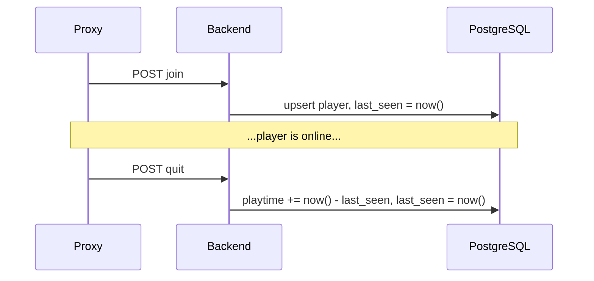
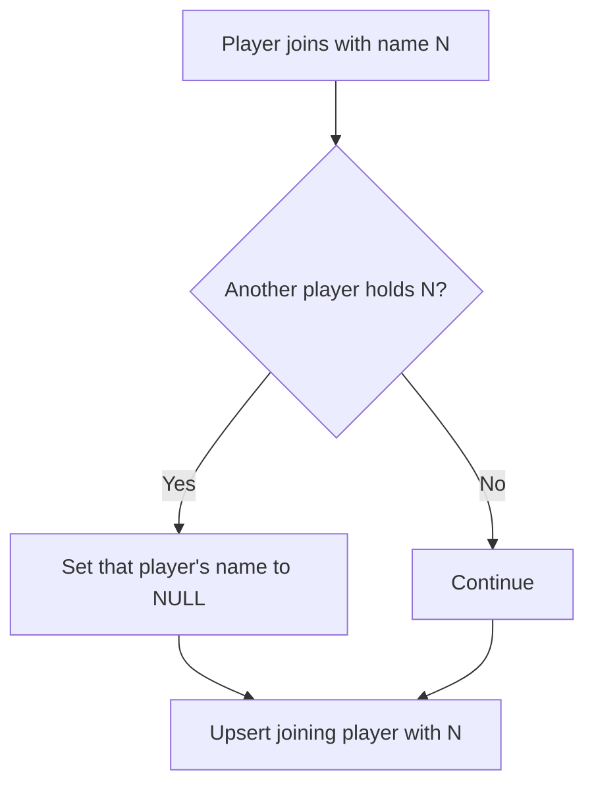
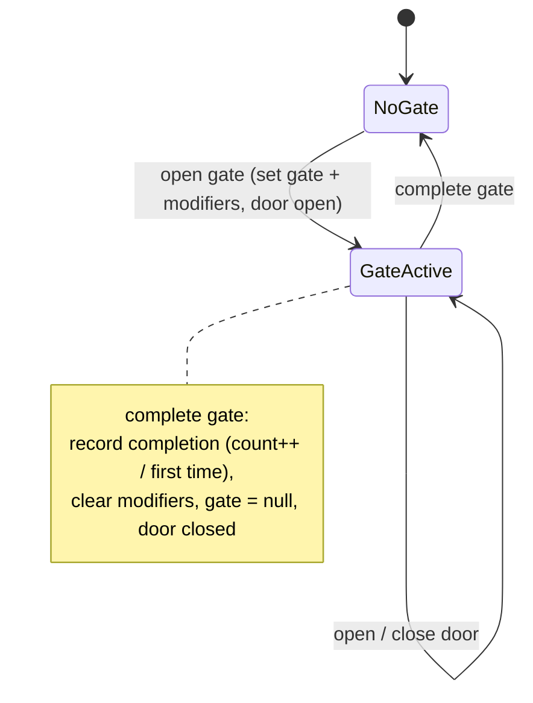
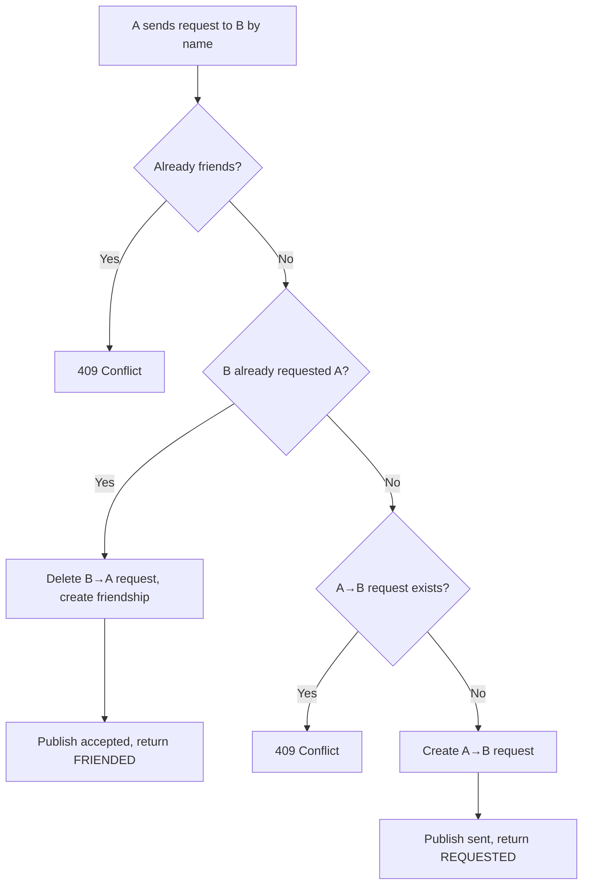
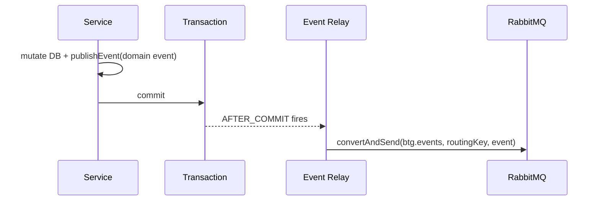

# Logical Flows

## Playtime accumulation

Playtime is accumulated on quit, computed entirely in the database so it's atomic and clock-consistent.

- **Online playtime** = stored `playtime` + (`now()` − `last_seen`).
- **Offline playtime** = stored `playtime`.

## Name reclaim on join

A player is the authoritative source for their current name. On join, the name is freed from any stale holder first.

The whole thing runs in one transaction, so the unique constraint is never violated.

## Dungeon door & gate lifecycle

- **open gate** starts a run; **complete gate** finishes it and records it in `dungeon_completed_gate`.
- **open/close door** only toggle `door_open`, keeping the active gate and modifiers.

## Friend request lifecycle (with auto-accept)

Cancel (by sender), accept/deny (by receiver) and unfriend each delete the relevant row and publish their event — returning `404` if the row didn't exist.

## After-commit event publishing

If the transaction rolls back, the relay never fires — so events are emitted only for changes that actually persisted.
