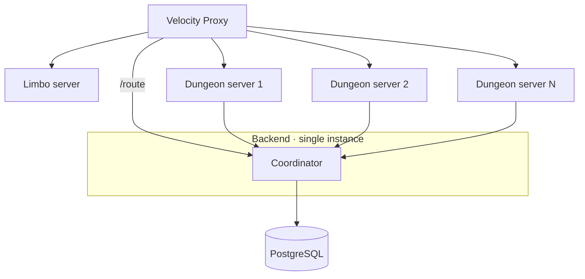
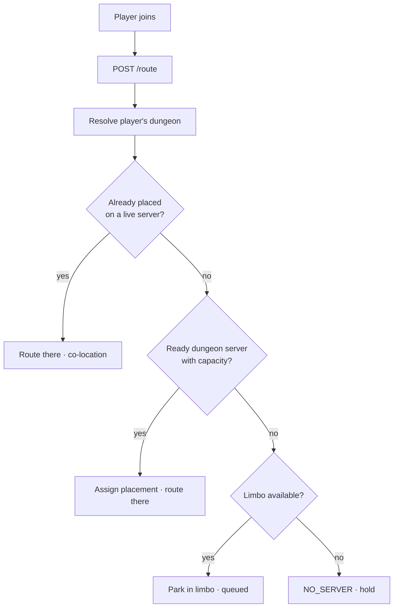

# Multi-Server

How Beyond the Gate runs **many Paper dungeon servers** behind one proxy, coordinated entirely by the backend. This is the concept; the concrete endpoints are in the [API](api.md#multi-server) and the tables in the [Data Model](data-model.md).

!!! abstract "Scope"
    This covers the **backend coordination** — registry, placement, presence, portable player state, routing, limbo. Starting and stopping Paper containers (fleet orchestration) is **not built yet**. Bans are enforced by the proxy at join, not here.

## The problem

One Paper server holding every dungeon world doesn't scale. But a dungeon world is **single-writer** — it can be open on only one server at a time — and players carry **state** (inventory, xp, hunger) that must follow them across servers without being duplicated or lost.

## Two invariants

Everything here exists to uphold these, and both are enforced *structurally* in PostgreSQL:

1. **A dungeon is hosted on at most one server at a time** — enforced by the primary key of `dungeon_placement` (`dungeon_uuid`).
2. **A player's live state is owned by at most one server at a time** — enforced by `player_state.held_by` plus a monotonic `version` fence.

## Topology

Dungeon servers are **stateless and interchangeable** — kill one and the only cost is reloading its worlds and reconnecting its players. They **self-register** on boot and heartbeat, so the backend never needs static per-server config.

## The coordination tables

| Table | Holds | Lock |
|---|---|---|
| `game_server` | registry: kind, address, status, capacity, last heartbeat | liveness = fresh heartbeat |
| `dungeon_placement` | which server hosts a dungeon's world + load state | **PK `dungeon_uuid`** (one host) |
| `player_session` | one live session per player: server, state, heartbeat | **PK `player_uuid`** (no double login) |
| `player_state` | portable inventory/xp/hunger blob | `held_by` + `version` |

## Join & routing

On join the proxy asks the backend one question — *which server?* — and the backend runs the placement decision:

Because routing **assigns the placement**, two players entering the same unplaced dungeon at once are guaranteed to land on the **same** server (the placement insert has a single winner). A player is therefore never on a server whose dungeon lives elsewhere.

## On the Paper server

Routing guarantees the player's dungeon belongs to *this* server. Paper asks [`POST /spawn`](api.md#spawn-resolve-on-join) for the dungeon and its `created` flag, then:

| Situation | Action |
|---|---|
| world already loaded here | **teleport** |
| not loaded, world exists (`created = false`) | **load** it → teleport |
| not loaded, no world yet (`created = true`) | **create** from template → confirm via [`world-initialized`](api.md#mark-world-initialized) → teleport |

Alongside, it pulls the player's inventory via [`GET /state`](api.md#player-state) and, on unload, saves and releases the placement. A dungeon server does nothing but load/create/teleport and sync state — never routing or placement decisions.

## Cross-server transfer

Moving a player between servers is where state can dupe or be lost, because on an internal switch the source's *quit* fires around the destination's *join*.

!!! tip "The proxy gates the reconnect on the save"
    The single proxy does not connect the player to the destination until the source has **saved and released** the player's state. Combined with the `version` fence — a stale write (`expectedVersion` ≠ stored) is rejected — the handoff is safe without a distributed lock.

Ownership moves as: `held_by = A` → *A saves + releases* → `held_by = null (vN)` → *B claims on load* → `held_by = B`.

## Limbo

A lightweight, always-on server that catches players with nowhere to go — no ready dungeon server, or a join throttle. It keeps them **connected (queued)** instead of kicking them; the backend releases them onto a real server as capacity frees up.

## Not built yet: fleet orchestration

The backend places players onto servers that **already exist and registered themselves**. It does not start or stop them. Fleet orchestration — a reconciliation loop that provisions and drains Paper containers by load — is the remaining piece. See [Scalability › Multiple Paper servers](../scalability.md#multiple-paper-servers).

## Identity & security

All servers share one `SERVICE_API_KEY` (`ROLE_SERVICE`); the key **authorizes but does not identify**. A server's identity is its self-reported `id` from registration, trusted because the key already gates the network boundary. Bans are enforced by the proxy at join — `/route` does not re-check them.
