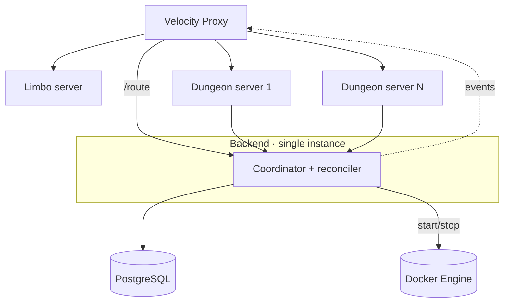
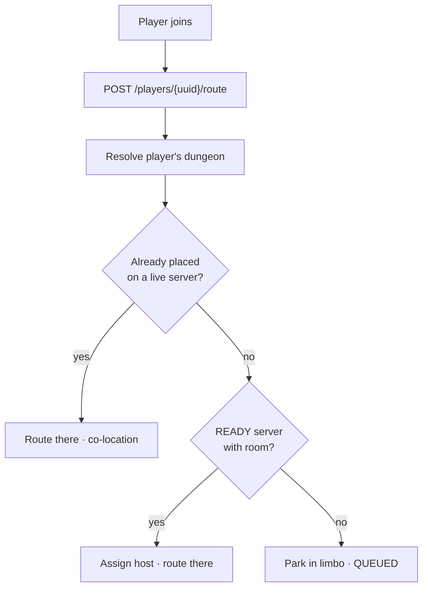
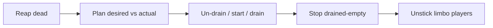

# Multi-Server

How Beyond the Gate runs **many Paper dungeon servers** behind one proxy, coordinated — and scaled — by the backend. This is the concept and the key flows; the endpoints are in the [API](api.md#multi-server), the events in [Events](events.md#multi-server), the tables in the [Data Model](data-model.md).

!!! abstract "What the backend does"
    Registry, placement, presence, portable player state, routing, limbo, **and** orchestration (starting/stopping dungeon-server containers). Bans are enforced by the proxy at join, not here.

## The problem

One Paper server holding every dungeon doesn't scale. But a dungeon world is **single-writer** (open on only one server at a time), and players carry **state** (inventory, xp, hunger) that must follow them across servers without being duplicated or lost.

## Two invariants

Both are enforced *structurally* in PostgreSQL:

1. **A dungeon is hosted on at most one server** — `dungeon.server_uuid` (one dungeon row → one host).
2. **A player's live state is owned by at most one server** — `player_state.held_by` + a monotonic `version` fence.

## Topology



Dungeon servers are **stateless and interchangeable** — they self-register on boot and heartbeat; kill one and the only cost is reloading its worlds and reconnecting its players. **Limbo** is a single always-on server named by config, not a registry row.

## The model (after consolidation)

Coordination lives **on the entities it describes** — there are no separate placement/session tables:

| Table / column | Holds |
|---|---|
| `dungeon_server` | registry: name, address, `status` (`READY`/`DRAINING`/…), `player_count`, `dungeon_count`, `last_heartbeat` |
| `dungeon.server_uuid` + `dungeon.status` | which server hosts the world + its load state (`LOADING`/`LOADED`/`SAVING`/`UNLOADING`) |
| `player.current_server_uuid` + `player.status` | presence: where the player is + `OFFLINE`/`QUEUED`/`CONNECTING`/`ONLINE` |
| `player_state` | portable inventory/xp/hunger blob, `held_by` + `version` |

A server is **alive** while `last_heartbeat` is within `btg.multiserver.heartbeat-timeout-seconds` (30s; Paper beats ~15s).

## Join &amp; routing

On join the proxy asks the backend one question — *which server?* Placement respects a soft cap (`players-per-server`, 50): new placements pick the least-loaded server **with room**; co-location ignores the cap; limbo only when all are full or none exist.



Routing **assigns the placement**, so two players entering the same unplaced dungeon at once land on the *same* server. `/route` is synchronous — the proxy connects the player using the returned `serverName`.

## Teleporting between dungeons

`POST /players/{uuid}/current-dungeon/{dungeonUuid}` (travel) resolves the target dungeon's host and returns where to send the player.

!!! warning "Paper contract"
    The **source server saves + releases the player's state (`PUT …/state`, `release=true`) *before* calling travel.** This is what makes the handoff safe — the destination always loads the latest released state, fenced by `version`.

=== "Cross-server"

    The target dungeon is hosted elsewhere. The backend emits **`player.transfer(uuid, serverName)`**; the proxy connects the player to the destination, which handles it like a fresh join.

    ```mermaid
    sequenceDiagram
        participant S1 as Source Paper
        participant API as Backend
        participant MQ as RabbitMQ
        participant Prox as Velocity
        participant S2 as Dest Paper
        S1->>API: PUT /state (release)
        S1->>API: POST /current-dungeon/{d}
        API->>API: resolveHost -> S2, set presence
        API->>MQ: player.transfer(uuid, S2)
        MQ->>Prox: consume
        Prox->>S2: connect player
        S2->>API: GET /state (claim) · POST /spawn · host/claim
        S2->>S2: load world, teleport in
    ```

=== "Same server"

    The target dungeon is on the server the player is already on. The backend returns the **same** server name and emits **no** transfer event; Paper just **teleports locally** (loading the world via ASP if needed) and re-acquires its state claim. No proxy hop, no handoff.

=== "No space"

    No READY server has room. The backend parks the player in **limbo** (`QUEUED`) and emits `player.transfer(uuid, "limbo")`. The reconciler counts queued players as demand, scales up (or un-drains), and on a later tick **unsticks** them — re-routing to the new server and emitting a fresh `player.transfer`. Nothing stays stuck.

## Orchestration

The backend can start and stop dungeon-server containers itself (`btg.orchestration.enabled`, off by default). A `@Scheduled` **reconciler** runs every `reconcile-interval-millis`:

1. **Reap** servers whose heartbeat went stale (crash) — deleting the row cascades placement/presence; emits `server.unregistered`.
2. **Scale** to `desired = clamp(ceil((serverPlayers + queued) / playersPerServer), min, max)`:
     - short → **reactivate DRAINING servers before starting** new containers;
     - over → **drain the emptiest** READY servers (they take no new players and stop once empty);
     - never starts unless every server is full.
3. **Stop** drained-empty servers (`server.unregistered`).
4. **Unstick** queued/limbo players onto servers that now have room.



Containers are managed through a swappable `ServerOrchestrator` (**Docker Engine API** today, over the mounted socket; Swarm/k8s later). A started container receives its identity (`BTG_SERVER_UUID/NAME/ADDRESS`) via env and **self-registers**; the backend never pre-creates the row.

!!! note "Proxy stays in sync"
    Registration and removal emit `server.registered` / `server.unregistered` so Velocity adds and drops backends dynamically as the fleet scales.

## Identity &amp; security

All servers share one `SERVICE_API_KEY` (`ROLE_SERVICE`); the key **authorizes but does not identify**. A server's identity is its self-reported `uuid` from registration, trusted because the key already gates the network boundary.

## What a dungeon server does

Routing guarantees the player's dungeon belongs to *this* server. Paper then: `/spawn` (dungeon + `created`) → load or clone-from-template the world (ASP) → `GET /state` (inventory) → `host/claim` → teleport. On `/stop` it calls `DELETE /servers/{uuid}` for a graceful, instant deregister (no waiting for a missed heartbeat). Nothing player- or world-durable lives on Paper.
