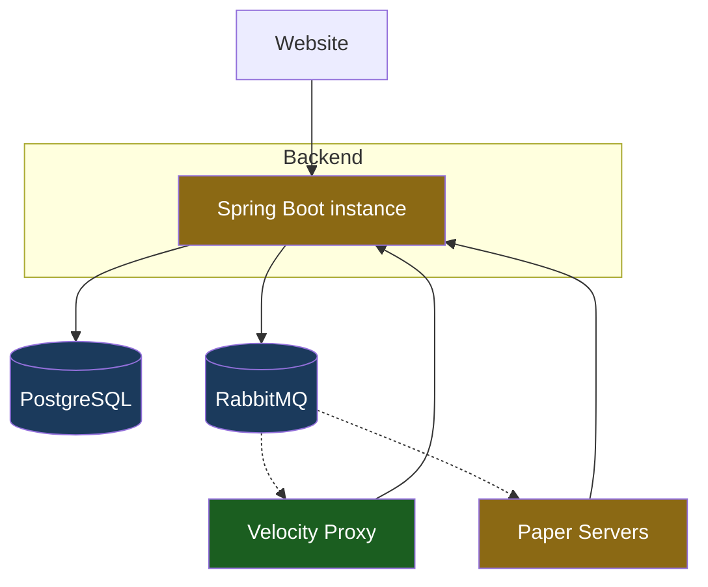

# Scalability

This page assesses the **Beyond the Gate** network's scalability as a whole — which components scale today, which don't, and what would be required to scale each. It is intentionally forward-looking: nothing here is an immediate task.

!!! note "Guiding principle"
    We deliberately run lean. **Redis and other scaling infrastructure are *not* wanted right now** — they would add containers to maintain and extra connections for no current benefit. The goal of this page is to *plan* for scale so the path is known, not to build for it prematurely. Each "fix" below is a future option, not a backlog item.

---

## Component overview

Current state: a **single** backend instance, **single** Paper server, one proxy, backed by PostgreSQL and RabbitMQ. Green = scales freely; amber = scales only after the changes noted below.

---

## Component assessment

### :material-check-circle: Velocity proxy — no action needed

Velocity comfortably handles thousands of concurrent connections on a single instance. It is **highly unlikely to ever need horizontal scaling**, so we make no plans for it.

### :material-database: PostgreSQL — scales vertically, sufficient

The database is a single source of truth and scales **vertically** (bigger instance) for the foreseeable future. Read replicas or partitioning are standard escape hatches if read load ever dominates, but nothing in the current design pushes toward that. **No action needed.**

### :material-rabbit: RabbitMQ — fine as-is

Events are fire-and-forget notifications (friend/moderation actions, verification codes). Throughput is trivial relative to RabbitMQ's capacity. **No action needed** at any realistic scale.

---

## Known scaling blockers in the backend

These are the things that would break or weaken **if a second backend instance were ever added**. None is a problem today on a single instance.

### :material-counter: In-memory rate limiting

**State:** Bucket4j buckets live in each instance's memory (`ConcurrentHashMap`).

**Problem when scaled out:** with *N* backend instances behind a load balancer, every instance keeps its own buckets. Effective limits **multiply by N** (a player allowed 120/min could do up to 120·N), and the per-IP limit on the public `/auth/**` routes — the one that actually matters for abuse — becomes proportionally weaker.

**Fix:** back the buckets with a **shared store (Redis)**. Bucket4j has first-class Redis support, so the filter logic stays the same; only the bucket storage changes. Until we scale out, in-memory is correct and simpler.

### :material-key: Single shared service API key

**State:** one durable `SERVICE_API_KEY` grants `ROLE_SERVICE` to every trusted MC service.

**Problems:**

- **No rotation/revocation per service** — rotating the key means coordinating every service at once.
- **No attribution** — we can't tell *which* server performed an action.
- **Single point of compromise** — one leaked key grants full `ROLE_SERVICE`.

This is a **security hardening** concern more than a throughput one, but it scales poorly as the number of services grows.

**Fix:** **per-service API keys** (a `service_client` table: key hash, service name, enabled flag). Enables rotation, revocation, and attribution, and shrinks the blast radius of a leak. The auth filter would resolve the key to a specific service identity instead of a single shared secret.

### :material-format-list-bulleted: Unbounded list endpoints

**State:** several reads return the **entire** result set — moderation history (full log, newest first), friends, accessible dungeons, collections.

**Problem:** fine while data is small, but a **latency and memory landmine** as it grows — a player with thousands of moderation log entries, or very large friend lists, would produce large responses and heavy queries.

**Fix:** add **pagination / bounds** (limit + cursor or offset) to list endpoints. Worth doing *before* any dataset realistically gets large; it's a contract change, so earlier is cheaper. Independent of horizontal scaling — this matters even on a single instance.

---

## Future: multiple Paper servers

Today there is one Paper server. If gameplay ever needed **multiple Paper instances**, two coordination problems appear that don't exist with one:

### Dungeon placement (which server holds which dungeon)

With several Paper servers, the network must know **which server is currently hosting a given dungeon's world**, so players (and visitors via travel) are routed to the right instance.

This is **coordination state, not persistence** — it's ephemeral "where is X right now" data that's recreated on restart, so it does **not** belong in PostgreSQL. The natural home is a **shared in-memory store (Redis)**: a map of `dungeon → hosting server`, claimed/released as worlds load and unload.

### Cross-server presence

Several features assume "everyone is on one server":

- **Online-name tab completion** for Paper commands — each server only knows its own players; with multiple servers, the online-name list must be **shared across servers** so completion behaves as if everyone is everywhere.
- More broadly, any "list online players" / presence feature becomes a cross-server concern.

**Fix:** a **shared presence set (Redis)**, updated as players join/leave any server, readable by all. The existing RabbitMQ events could also propagate presence changes. In this case this could also be the baseline for an "Online Player API" which replaces the current pattern where some endpoints require passing a boolean "online" to the backend.

---

## Summary

| Component | Scales now? | Blocker | Fix when needed |
|---|---|---|---|
| Velocity proxy | ✅ Yes | — | (not foreseen) |
| PostgreSQL | ✅ Vertically | — | replicas / partitioning |
| RabbitMQ | ✅ Yes | — | — |
| Backend (horizontal) | ⚠️ Single instance | in-memory rate limits | Redis-backed buckets |
| Service auth | ⚠️ Works, weakly | one shared key | per-service keys + `service_client` |
| List endpoints | ⚠️ Unbounded | no pagination | limit + cursor |
| Multiple Paper servers | ❌ Not designed for | no dungeon-placement / presence coordination | Redis placement map + presence set |

**Bottom line:** the network runs correctly and efficiently as a **single backend + single Paper** today, and that is intentional. The two recurring enablers for scaling out are **Redis** (rate limits, dungeon placement, presence) and **per-service API keys** (auth hardening). Neither is needed now; both are understood and planned for.
