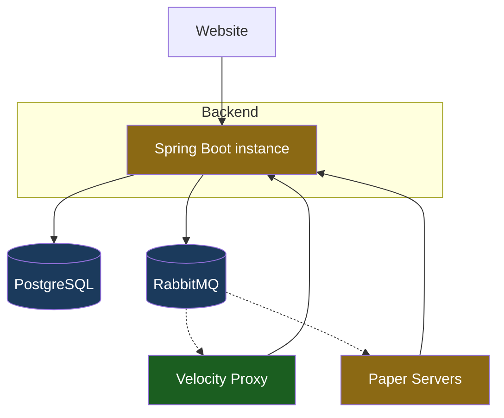

# Scalability

This page assesses the **Beyond the Gate** network's scalability as a whole — which components scale today, which don't, and what would be required to scale each. It is intentionally forward-looking: nothing here is an immediate task.

!!! note "Guiding principle"
    We deliberately run lean. **Redis and other scaling infrastructure are *not* wanted right now** — they would add containers to maintain and extra connections for no current benefit. The goal of this page is to *plan* for scale so the path is known, not to build for it prematurely. Each "fix" below is a future option, not a backlog item.

---

## Component overview

Current state: a **single** backend instance and one proxy, backed by PostgreSQL and RabbitMQ. The backend now coordinates **multiple** Paper dungeon servers (registry, placement, presence, routing) — see [Multiple Paper servers](#multiple-paper-servers). Green = scales freely; amber = scales only after the changes noted below.

---

## Component assessment

### :material-check-circle: Velocity proxy — no action needed

Velocity comfortably handles thousands of concurrent connections on a single instance. It is **highly unlikely to ever need horizontal scaling**, so we make no plans for it.

### :material-database: PostgreSQL — scales vertically, sufficient

The database is a single source of truth and scales **vertically** (bigger instance) for the foreseeable future. Read replicas or partitioning are standard escape hatches if read load ever dominates, but nothing in the current design pushes toward that. **No action needed.**

### :material-rabbit: RabbitMQ — fine as-is

Events are fire-and-forget notifications (friend/moderation actions, verification codes). Throughput is trivial relative to RabbitMQ's capacity. **No action needed** at any realistic scale.

---

## Known scaling blockers in the backend

These are the things that would break or weaken **if a second backend instance were ever added**. None is a problem today on a single instance.

### :material-counter: In-memory rate limiting

**State:** Bucket4j buckets live in each instance's memory (`ConcurrentHashMap`).

**Problem when scaled out:** with *N* backend instances behind a load balancer, every instance keeps its own buckets. Effective limits **multiply by N** (a player allowed 120/min could do up to 120·N), and the per-IP limit on the public `/auth/**` routes — the one that actually matters for abuse — becomes proportionally weaker.

**Fix:** back the buckets with a **shared store (Redis)**. Bucket4j has first-class Redis support, so the filter logic stays the same; only the bucket storage changes. Until we scale out, in-memory is correct and simpler.

### :material-key: Single shared service API key

**State:** one durable `SERVICE_API_KEY` grants `ROLE_SERVICE` to every trusted MC service.

**Problems:**

- **No rotation/revocation per service** — rotating the key means coordinating every service at once.
- **No attribution** — we can't tell *which* server performed an action.
- **Single point of compromise** — one leaked key grants full `ROLE_SERVICE`.

This is a **security hardening** concern more than a throughput one, but it scales poorly as the number of services grows.

**Fix:** **per-service API keys** (a `service_client` table: key hash, service name, enabled flag). Enables rotation, revocation, and attribution, and shrinks the blast radius of a leak. The auth filter would resolve the key to a specific service identity instead of a single shared secret.

### :material-format-list-bulleted: Unbounded list endpoints

**State:** several reads return the **entire** result set — moderation history (full log, newest first), friends, accessible dungeons, collections.

**Problem:** fine while data is small, but a **latency and memory landmine** as it grows — a player with thousands of moderation log entries, or very large friend lists, would produce large responses and heavy queries.

**Fix:** add **pagination / bounds** (limit + cursor or offset) to list endpoints. Worth doing *before* any dataset realistically gets large; it's a contract change, so earlier is cheaper. Independent of horizontal scaling — this matters even on a single instance.

---

## Multiple Paper servers

The backend now includes the **coordination layer** for running several Paper dungeon servers — see the [API](backend/api.md#multi-server) and [data model](backend/data-model.md). It is built in **PostgreSQL, not Redis**: because the backend stays a single instance, Postgres is the single coordinator and needs no extra infrastructure.

What exists:

- **Server registry** (`dungeon_server`) — servers self-register on boot and heartbeat; liveness is derived from heartbeat freshness.
- **Dungeon placement** (`dungeon.server_uuid`) — which server hosts a dungeon's world. One dungeon row → one host is the **single-writer lock**; a host is stolen only from a *dead* server.
- **Presence** (`player.current_server_uuid` + `player.status`) — where each player is and their state (`OFFLINE`/`QUEUED`/`CONNECTING`/`ONLINE`); the basis for cross-server "who's online / where".
- **Portable player state** (`player_state`) — inventory/xp/hunger as a versioned blob with a `held_by` ownership lock, so state moves cleanly between servers on transfer.
- **Routing** (`/route`) — on join the proxy asks the backend which server to connect to: the live host of the player's dungeon (co-location), else the least-loaded server with room, else **limbo**.

!!! note "Why PostgreSQL, not Redis"
    Earlier this page assumed placement/presence would be ephemeral state in Redis. That reasoning only holds if the *backend* is scaled out. Since it isn't, Postgres is simplest and correct — one coordinator, no extra containers. Redis stays the escape hatch only if heartbeat/presence write volume ever demands it.

### Fleet orchestration

The backend **starts and stops dungeon-server containers itself** (`btg.orchestration.enabled`, off by default). A scheduled reconciler scales to `desired = clamp(ceil((players + queued) / players-per-server), min, max)`: it reactivates draining servers before starting new ones, drains the emptiest when over-provisioned, reaps crashed servers, and unsticks limbo players. Containers go through a swappable `ServerOrchestrator` (Docker Engine API today), and `server.registered` / `server.unregistered` events keep the proxy's backend list in sync. See [Multi-Server › Orchestration](backend/multi-server.md#orchestration).

---

## Summary

| Component | Scales now? | Blocker | Fix when needed |
|---|---|---|---|
| Velocity proxy | ✅ Yes | — | (not foreseen) |
| PostgreSQL | ✅ Vertically | — | replicas / partitioning |
| RabbitMQ | ✅ Yes | — | — |
| Backend (horizontal) | ⚠️ Single instance | in-memory rate limits | Redis-backed buckets |
| Service auth | ⚠️ Works, weakly | one shared key | per-service keys + `service_client` |
| List endpoints | ⚠️ Unbounded | no pagination | limit + cursor |
| Multiple Paper servers | ✅ Coordinated &amp; orchestrated | — | Docker today; Swarm/k8s later |

**Bottom line:** the network runs on a **single backend** (intentionally) that now coordinates **multiple Paper servers** through PostgreSQL — no Redis required, since only the backend would need a shared store and it isn't scaled out. The remaining enablers, only if/when needed, are **Redis** (rate limits, if the backend is ever scaled out) and **per-service API keys** (auth hardening). Fleet **orchestration** — auto start/stop of Paper containers via Docker — is now built.
